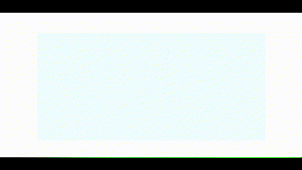

# Drawing the Sierpiński triangle

**[Live Demo](https://therealprohacker.github.io/sierpinski/)**

Original idea: https://www.instagram.com/reel/CtYxBvbscK3/

This JS app draws a Sierpiński triangle in a canvas using the method shown above. ~~The state is saved locally in a cookie so it can be resumed at any time.~~

